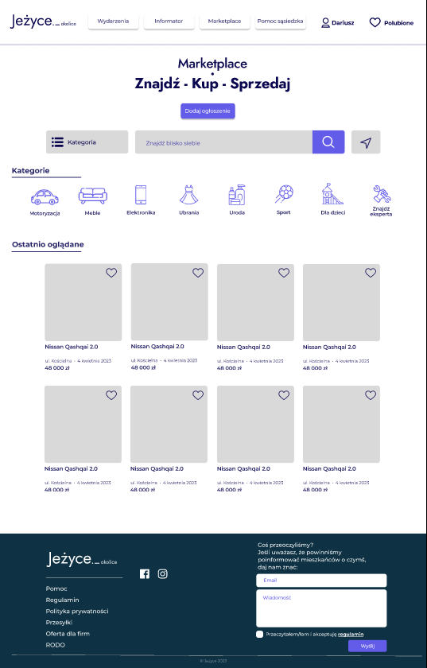
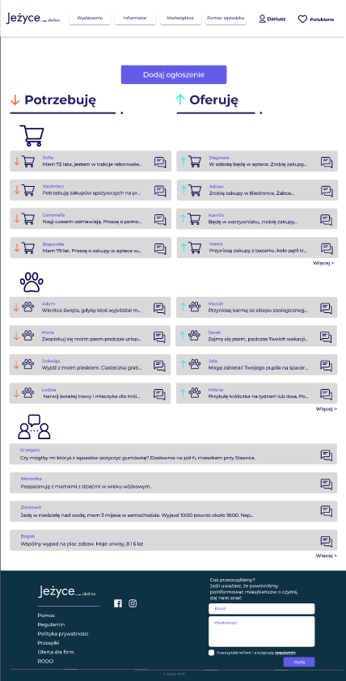
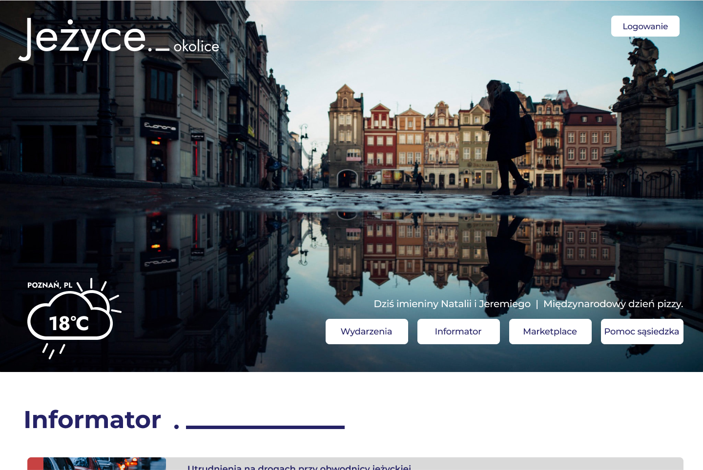
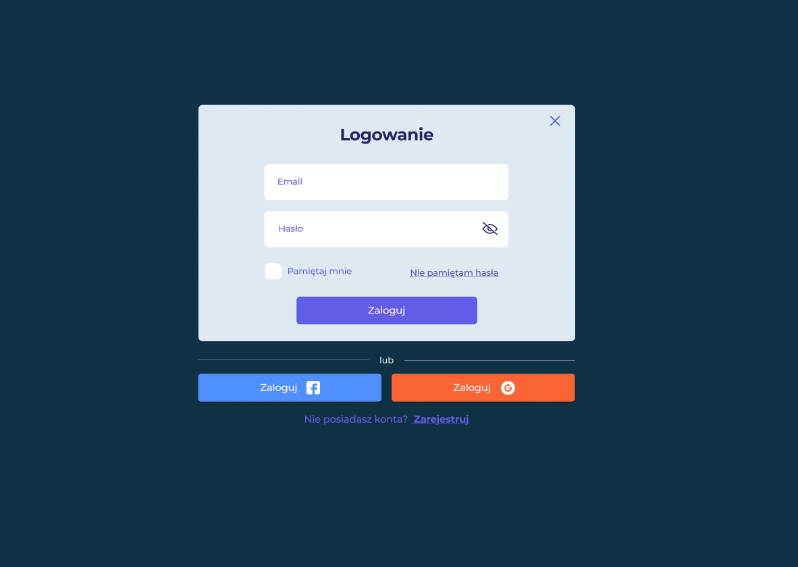
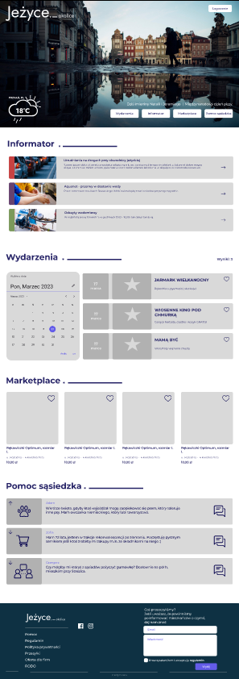
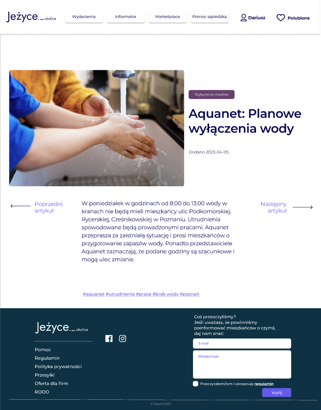

# Jeżyce District Portal – UX Design Project

**Local Community Portal Prototype for Jeżyce District, Poznań, Poland**

---

## 🔗 Interactive Prototype

### **[👉 Open Figma Prototype](https://www.figma.com/proto/IWlAlOvqULVqyZmkbOU28Q/Je%C5%BCyce-Group_project_of_a_portal_for_the_local_community_of_the_Je%C5%BCyce_district_in_the_city_of_Pozna?node-id=26-264&t=mQZtyNfz7HYRIS4Z-1&scaling=min-zoom&content-scaling=fixed&page-id=0%3A1&starting-point-node-id=26%3A264)**

**Click to explore the working prototype of Jeżyce Portal →**

---

## 🎓 Certificate

**[📜  UX Design Course Completion Certificate](https://drive.google.com/file/d/1-0wfMxJvJTw_wPVSy9vWiMFosz7Nj3r4/view)**

---

## 📸 Project Screenshots

<table>
  <tr>
    <td width="50%">
      <h3>Homepage - Hero Section</h3>
      
      
<i>Landing page with hero image of Poznań's Old Town, weather widget, and main navigation to all 4 portal sections</i>

    </td>
    <td width="50%">
      <h3>Homepage - Sections Overview</h3>
      
      
<i>Scrolled view showing preview of all portal sections: Informator, Wydarzenia, Marketplace, and Neighbor Help</i>

    </td>
  </tr>
  <tr>
    <td>
      <h3>Bulletin - Article Detail</h3>
      
      
<i>Municipal announcement article about water shutdowns with navigation and article metadata</i>

    </td>
    <td>
      <h3>Marketplace - Browse & Categories</h3>
      
      
<i>Marketplace landing page with category filters (cars, furniture, electronics, clothing) and product listings grid</i>

    </td>
  </tr>
  <tr>
    <td>
      <h3>Neighbor Help - Request & Offer Board</h3>
      
      
<i>Community assistance board split into "Need Help" and "Offer Help" sections for shopping, pet care, and services</i>

    </td>
    <td>
      <h3>User Authentication - Login Modal</h3>
      
      
<i>Login overlay with email/password authentication and social login options (Facebook, Google)</i>

    </td>
  </tr>
</table>

---

## 🎯 Project Goal

The project aimed to **create a district portal prototype** that would:
- Serve the local community
- Foster neighborhood integration
- Address residents' current needs

The goal was selected through voting from three proposals collected from UX Design course participants.

---

## 👥 Team & Methodology

### Project Team
- **3-person UX design team**
- Work in **weekly sprints**
- 2-3 meetings per week
- **Project log** (Dzienniczek Limonki) maintenance

### Methodology
- **Design Thinking** (Empathize → Define → Ideate → Prototype → Test)
- **Value Proposition Canvas**
- **User Personas**
- **Online survey research**
- **Competitive analysis**

---

## 🔍 Research & Analysis

### Competitive Benchmarking
We analyzed existing portals and social media groups:
- Kraków.pl
- Epoznan.pl
- Facebook groups: Nowohucianie, SŻNWT, Nowy Huta, Zapytaj sąsiada, Prądnik Czerwony, Reduta

### Online Survey
- **Method:** Google Forms, distributed via email and Facebook
- **Goal:** Understand user perspectives (EMPATHIZE) and define problems (DEFINE)

---

## 📊 Target Audience (Survey-Based)

### Demographics
- **100%** use the internet
- **70%** use neighborhood Facebook groups
- **90%** live in a large city
- **90%** professionally active

### Respondent Profile
| Characteristic | Percentage |
|----------------|-----------|
| **Gender** | Women 55% / Men 45% |
| **Age** | Up to 26: 14% / 27-35: 27% / 36-50: 41% / 50+: 18% |
| **In relationships** | 80% |
| **With children** | >75% |
| **Property owners** | 60% |
| **Pet owners** | 50% |

### Psychographic Traits
- **76%** interested in the welfare of district residents
- **67%** feel emotional connection to their place of residence
- **60%** make acquaintances online
- Empathetic, willing to help elderly and those in need

---

## 🎯 Identified Problems

### Top User Pain Points:
1. **Lack of information** about renovations, accidents, street closures
2. **Support for elderly** – groceries, medication shopping
3. **Pet care** during illness or vacations
4. **Finding trusted professionals**
5. **Buying/selling used items** among local residents
6. **Reluctance to pay** for services (unless unique content + local discounts)
7. **Lack of interest** among youth in similar portals

**Need #1:** Over **90% of respondents** expect **news** about:
- Traffic disruptions
- Renovations
- Cultural events, concerts, picnics, local events

---

## 💡 Solution – Portal Features

The Jeżyce District Portal includes 4 main sections:

### 1️⃣ **EVENTS** 🎭
Information about current cultural events:
- Art exhibitions, concerts
- Picnics, local events
- Mass gatherings

### 2️⃣ **BULLETIN** 🚧
Municipal announcements:
- Road and infrastructure disruptions
- Power, water, gas supply outages
- Planned renovations
- Street closure notifications

### 3️⃣ **MARKETPLACE** 🛒
Local commerce exchange:
- Used item sales between residents
- Local professional services
- Item exchange/lending

### 4️⃣ **NEIGHBOR HELP** 🤝
Mutual assistance announcement system:
- Shopping assistance (for elderly/ill)
- Pet care
- Small jobs and repairs
- *(Future: User verification system based on reviews)*

---

## 🎨 Prototype & User Flow

### Key Screens:
1. **Home page** – Overview of all sections
2. **Events** – Local events calendar
3. **Bulletin** – Municipal announcements (filters: category, date)
4. **Marketplace** – Buy/sell listings (categories)
5. **Neighbor Help** – Add/browse assistance requests

---

## 🛠️ Tools & Process

| Stage | Tools |
|-------|-------|
| **Research** | Google Forms, Facebook Groups Analysis, Web Benchmarking |
| **User Analysis** | Value Proposition Canvas, User Personas (3 personas) |
| **Design** | Figma |
| **Project Management** | Project log, Weekly sprints |
| **Methodology** | Design Thinking Framework |

---

## 📈 Key Insights

### ✅ Validated Need
- **90%+** respondents need a portal with local news
- **76%** interested in district life
- **70%** already use FB groups but need better UX

### ⚠️ Challenges
- **Reluctance to pay** – business model requires further analysis
- **Youth** (under 26) - low target group penetration
- Need for **user verification system** for Neighbor Help

### 🔮 Future Directions
- User opinion/reputation system
- Integration with local businesses (discounts, promotions)
- Gamification (rewards for social activity)
- Mobile application

---

## 👤 User Personas

### Persona 1: **Active Mom** (36-50 years)
- Professionally employed, has children
- Seeks family event information
- Needs trusted local services (plumber, electrician)
- Active on FB groups

### Persona 2: **Local Senior** (50+ years)
- Long-time resident
- Needs shopping assistance
- Reads municipal announcements
- Limited digital mobility

### Persona 3: **Young Professional** (27-35 years)
- New district resident
- Wants to meet neighbors
- Seeks cultural events
- Buys/sells used furniture

---

## 📊 Success Metrics (Proposed)

| Metric | Target |
|--------|--------|
| **Monthly active users** | 5,000+ (10% of Jeżyce residents) |
| **Neighbor Help listings/month** | 50+ |
| **Marketplace sales/month** | 200+ transactions |
| **Engagement rate** | >30% (visits 2+ times/week) |
| **User satisfaction (NPS)** | >40 |

---

## 🎓 Skills Demonstrated

- **User Research** – Online surveys, competitive analysis
- **Design Thinking** – Full process from empathize to prototype
- **Information Architecture** – 4-section main structure
- **Prototyping** – High-fidelity interactive prototype (Figma)
- **Collaboration** – Team work in sprints
- **Presentation** – Research results communication

---

## 📧 Contact

**Dariusz Piasecki**  
📧 Email: d.piasecki@piasecki photos.com  
🔗 LinkedIn: [linkedin.com/in/piaseckiphotos](https://linkedin.com/in/piaseckiphotos)  
🐙 GitHub: [github.com/Dariusz-Piasecki](https://github.com/Dariusz-Piasecki)  
🌐 Portfolio: [piaseckiphotos.com](https://piaseckiphotos.com)

---

## 📄 License

Educational project created as part of UX Design course (2023).
